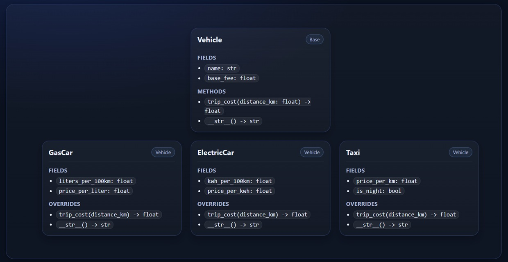

# OOP Inheritance Exercise 

## Goal

Practice **inheritance**, **method overriding**, and **`__str__` customization** by building a small class hierarchy

You will implement one **base class** and a few **inheriting classes**, similar in difficulty to the Shapes example — but in a totally different domain

## Scenario: Vehicles and Trip Cost

You are building a mini system that represents different kinds of vehicles and calculates the **cost of a trip**

Each vehicle has a way to calculate:

* `trip_cost(distance_km)` → how much it costs to travel `distance_km` kilometers
* `__str__()` → a nice printable description

No abstract classes in this exercise (so no `ABC`, no `@abstractmethod`)

## Requirements

### 1) Base Class: `Vehicle`

Create a class called `Vehicle`

**Fields**

* `name` (string)
* `base_fee` (float) — fixed cost per trip

**Methods**

* `trip_cost(distance_km)`

  * Default implementation: return `base_fee`
  * (Yes, the base vehicle is not very useful — it’s just a starting point)

* `__str__()`

  * Should return something like:

    * `name: Vehicle, base_fee: 5.0`

### 2) Inheriting Class: `GasCar`

A car that uses gasoline

**Constructor inputs**

* `liters_per_100km` (float)
* `price_per_liter` (float)
* `base_fee` (float) — pass to parent

**Rules**

* `name` should become: `"GasCar"`

* Override `trip_cost(distance_km)`:

  * fuel_used = `(distance_km / 100) * liters_per_100km`
  * return `base_fee + fuel_used * price_per_liter`

* Override `__str__()` to include all fields + trip cost for a sample distance (example: 50 km)

### 3) Inheriting Class: `ElectricCar`

An electric car that consumes kWh

**Constructor inputs**

* `kwh_per_100km` (float)
* `price_per_kwh` (float)
* `base_fee` (float)

**Rules**

* `name` should become: `"ElectricCar"`

* Override `trip_cost(distance_km)`:

  * energy_used = `(distance_km / 100) * kwh_per_100km`
  * return `base_fee + energy_used * price_per_kwh`

* Override `__str__()` similarly

### 4) Inheriting Class: `Taxi`

A taxi charges per km and may include a “night surcharge”

**Constructor inputs**

* `price_per_km` (float)
* `is_night` (bool)
* `base_fee` (float)

**Rules**

* `name` should become: `"Taxi"`

* Override `trip_cost(distance_km)`:

  * cost = `base_fee + distance_km * price_per_km`
  * if `is_night` is True → add **20%** to the cost

* Override `__str__()` similarly

## What to Build (Checklist)

* [ ] Implement `Vehicle`
* [ ] Implement `GasCar(Vehicle)`
* [ ] Implement `ElectricCar(Vehicle)`
* [ ] Implement `Taxi(Vehicle)`
* [ ] Override `trip_cost` in each child class
* [ ] Override `__str__` in each child class

## Demo Code You Must Write

Write code that:

1. Creates at least one instance of each vehicle type
2. Prints each object
3. Calculates and prints the cost for the same trip distance (example: 120 km)

Example (your numbers can be different):

* GasCar: liters_per_100km=7.2, price_per_liter=7.1, base_fee=5
* ElectricCar: kwh_per_100km=16, price_per_kwh=1.2, base_fee=4
* Taxi: price_per_km=3.8, is_night=True, base_fee=12

Good luck 🚀

Submit email: **[pythonai200425+oop2@gmail.com](mailto:pythonai200425+oop2@gmail.com)**
